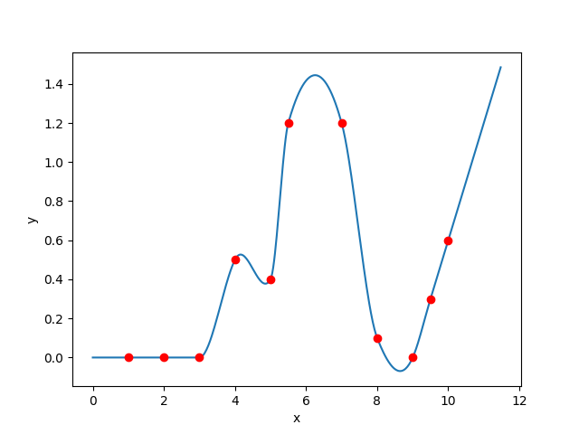
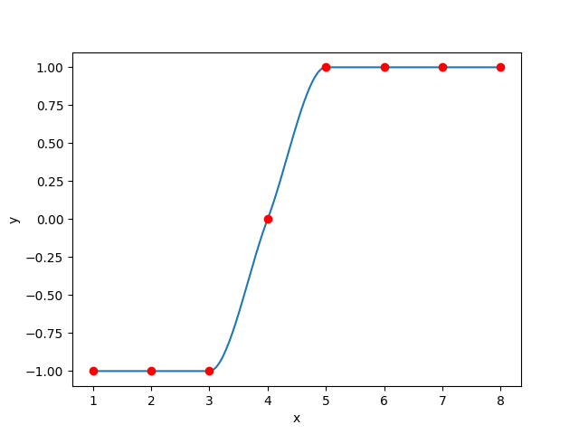

# makima_spline
A implementation of the modified akima interpolation<br>
**+** linear extrapolation<br>
**+** 1., 2., and 3. order derivatives<br>
**+** bicubic interpolation as a feature




## HowTo
```rust
use makima_spline::Spline;
```
your data is in some format
```rust
let x = vec![1., 2., 3., 4., 5., 6., 7., 8.];
let y = vec![-1., -1., -1., 0.0, 1., 1., 1., 1.];
``` 
convert to the type used by the spline `Vec<(f64, f64)>`
```rust
let points = makima_spline::vec_to_points(&x, &y);
```    
build the spline from the data-points
```rust
let spline = Spline::from_vec(points);
```
To sample do this:
```rust
let y = spline.sample(x);
```


# 2d interpolation
Based on the [bicubic](https://crates.io/crates/bicubic) crate it is possible to interpolate in two dimensions. 

Create points
``` rust
let x = vec![-1.0, 0.0, 2.0];
let y = vec![-0.0, 1.0];
let f = vec![5.0, 4.0, 5.0, 1.0, 1.0, 1.0];
``` 
construct `Bicubic` Struct
``` 
let bci = makima_spline::n_dimensional::bicubic_from_grid(&x, &y, &f);
```

The submodule is called `n_dimensional` in case higher dimensions will be supported in the future, but currently there is only 2d interpolation